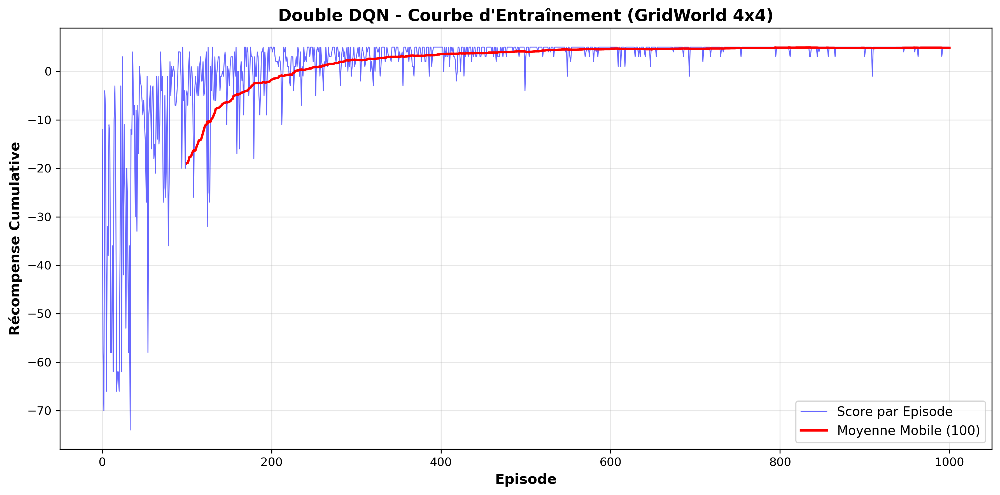
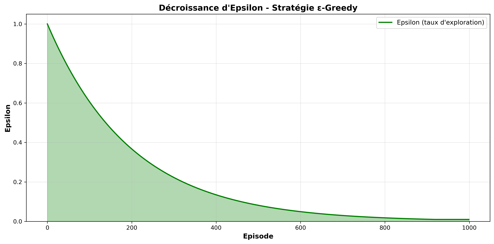
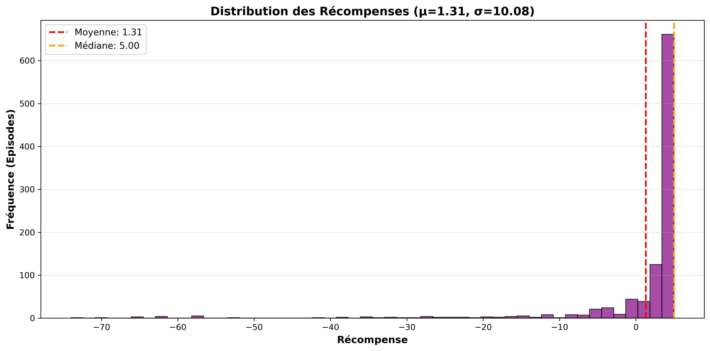
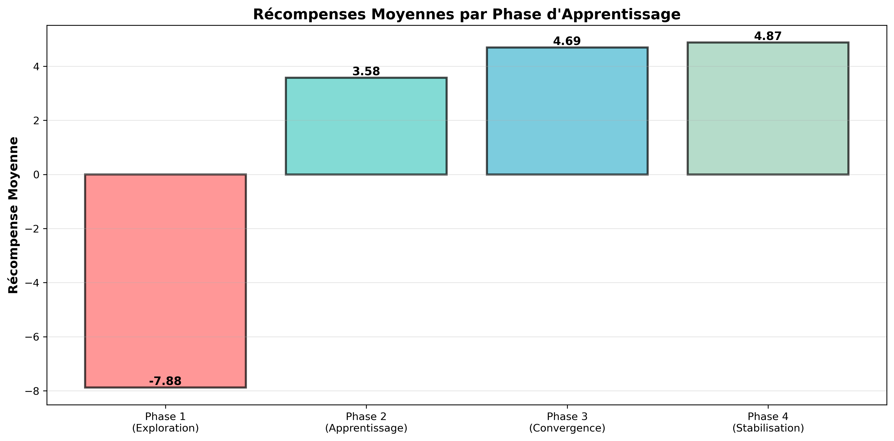
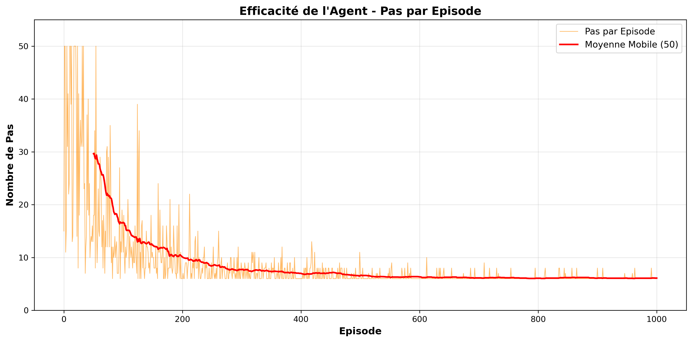
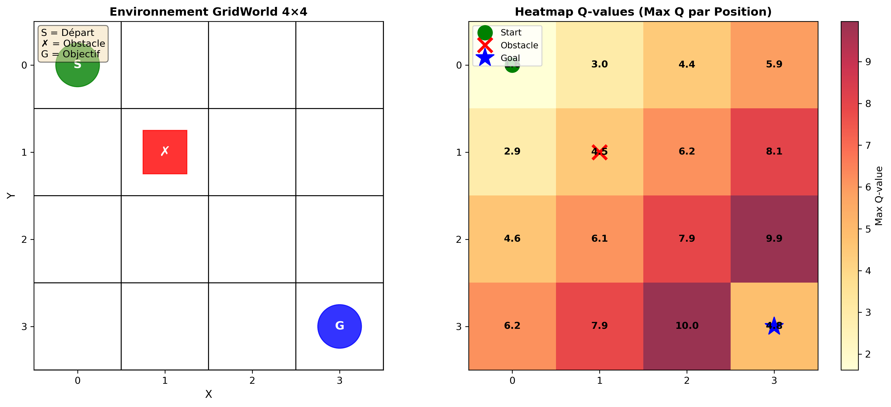
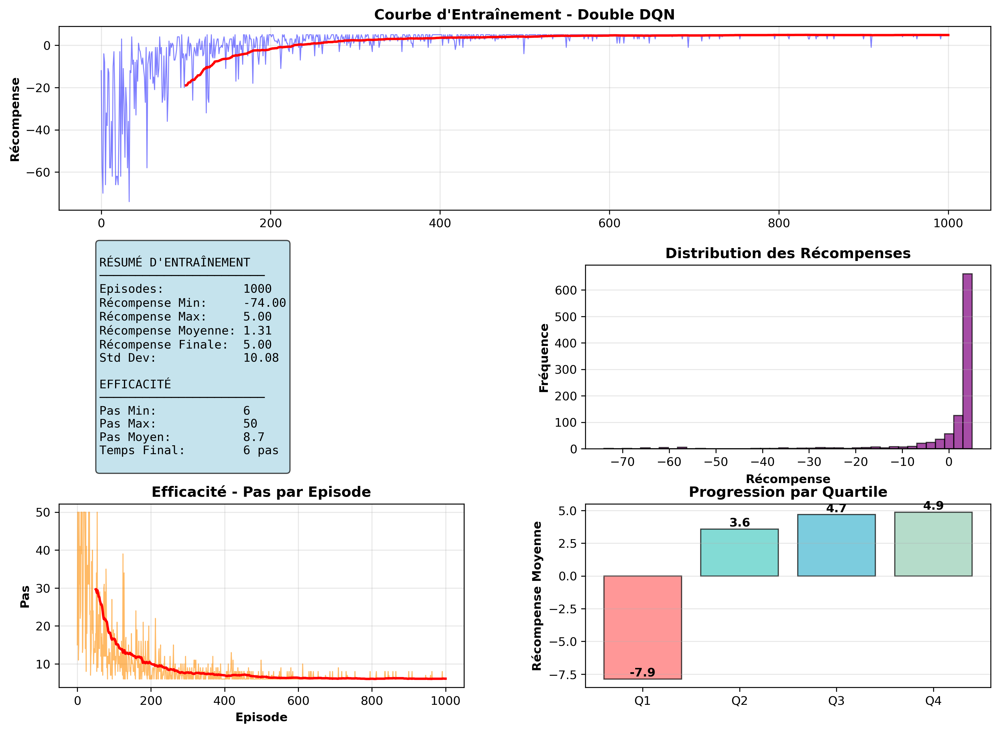

# Rapport de Devoir - Double DQN sur GridWorld

## 1. Contexte et objectif

Ce projet présente la mise en oeuvre d'un agent d'apprentissage par renforcement de type **Double DQN (Deep Q-Network)** appliqué a un environnement **GridWorld 4x4**.

L'objectif principal est de montrer, de maniere reproductible, qu'un agent peut apprendre une politique efficace pour atteindre un but dans une grille, tout en evitant un obstacle, avec analyse complete des performances via figures.

## 2. Problematique

L'environnement est defini comme suit :

- Grille de taille `4x4`
- Position initiale de l'agent : `(0,0)`
- Position de l'objectif : `(3,3)`
- Position de l'obstacle : `(1,1)`
- Actions possibles : `haut`, `bas`, `gauche`, `droite`

Schema de recompense :

- `+10` si l'objectif est atteint
- `-5` si l'agent passe sur l'obstacle
- `-1` pour chaque deplacement standard

Cette formulation encourage des trajectoires courtes et penalise les comportements inefficaces.

## 3. Approche methodologique

### 3.1 Pourquoi Double DQN

Le DQN classique a tendance a surestimer les valeurs d'action. Le **Double DQN** corrige ce biais en separant :

- la selection de la meilleure action via le reseau `online`
- l'evaluation de cette action via le reseau `target`

Formulation utilisee :

$$a^* = \arg\max_a Q_{online}(s', a)$$

$$y = r + \gamma Q_{target}(s', a^*)$$

Cette separation stabilise l'apprentissage et ameliore la convergence.

### 3.2 Composants de l'agent

- `Replay Buffer` (memoire d'experience) pour decorreler les echantillons
- Strategie `epsilon-greedy` pour equilibrer exploration/exploitation
- Reseau `target` mis a jour periodiquement
- Reseau de neurones dense :
    - Couche 1 : 24 neurones (ReLU)
    - Couche 2 : 24 neurones (ReLU)
    - Sortie : 4 neurones (Q-values des 4 actions)

## 4. Configuration experimentale

Les hyperparametres utilises dans l'experience sont :

- Episodes : `1000`
- Pas max par episode : `50`
- `gamma` : `0.9`
- Learning rate : `0.01`
- Epsilon initial : `1.0`
- Epsilon minimum : `0.01`
- Decroissance epsilon : `0.995`
- Batch size : `32`
- Taille memoire : `2000`
- Mise a jour du target network : toutes les `10` episodes

## 5. Resultats quantitatifs

Resultats extraits de `figures/training_summary.txt` :

- Recompense moyenne globale : `1.31`
- Recompense maximale : `5.00`
- Recompense minimale : `-74.00`
- Ecart-type : `10.08`
- Recompense finale : `5.00`

- Moyenne des 100 derniers episodes : `4.86`
- Moyenne des 50 derniers episodes : `4.90`

- Pas moyen par episode : `8.73`
- Pas minimum : `6`
- Pas maximum : `50`
- Moyenne des pas en fin d'apprentissage : `6.10`

Progression par phases :

- Phase 1 (0-250, exploration) : `-7.88`
- Phase 2 (250-500, apprentissage) : `3.58`
- Phase 3 (500-750, convergence) : `4.69`
- Phase 4 (750-1000, stabilisation) : `4.87`

Amelioration de la phase 1 a la phase 4 : `+12.75` (soit `+161.9%`).

## 6. Analyse des figures

Les figures sont generees automatiquement dans le dossier `figures/`.

### Figure 1 - Courbe d'entrainement



Montre l'evolution des recompenses par episode et leur moyenne mobile. On observe une tendance ascendante nette, signe d'un apprentissage effectif.

### Figure 2 - Decroissance epsilon



Visualise la transition progressive de l'exploration vers l'exploitation. Epsilon passe de `1.0` a `0.01`, soit une reduction de `99%`.

### Figure 3 - Distribution des recompenses



Permet d'analyser la variabilite des episodes. La distribution illustre une forte amelioration globale avec diminution progressive des episodes tres negatifs.

### Figure 4 - Recompenses par phase



Mise en evidence des differentes etapes d'apprentissage (exploration, apprentissage, convergence, stabilisation) et de l'amelioration continue entre phases.

### Figure 5 - Nombre de pas par episode



Mesure l'efficacite de la politique apprise. La baisse du nombre moyen de pas indique que l'agent trouve des trajets plus courts vers l'objectif.

### Figure 6 - Visualisation GridWorld et heatmap



Représentation de l'environnement et des valeurs apprises, utile pour interpreter qualitativement la strategie de l'agent sur la grille.

### Figure 7 - Dashboard comparatif global



Vue synthetique des metriques principales pour une lecture rapide des performances finales du systeme.

## 7. Interprétation et discussion

Les resultats montrent que l'agent Double DQN apprend une politique stable et performante :

- Les recompenses deviennent majoritairement positives en fin d'entrainement
- Le nombre de pas diminue vers une trajectoire quasi optimale
- La stabilisation sur les derniers episodes confirme la convergence

Malgre quelques episodes difficiles en debut d'apprentissage (scores tres negatifs), la dynamique globale est conforme au comportement attendu d'un agent en apprentissage par renforcement profond.

## 8. Structure du projet

```
Deep Q-Learning sur GridWorld/
|-- devoir_complet.py
|-- my_model.keras
|-- README.md
|-- requirements.txt
`-- figures/
        |-- 01_training_curve.png
        |-- 02_epsilon_decay.png
        |-- 03_reward_distribution.png
        |-- 04_rewards_by_phase.png
        |-- 05_steps_per_episode.png
        |-- 06_gridworld_visualization.png
        |-- 07_comparison_dashboard.png
        `-- training_summary.txt
```

## 9. Reproduction des experiences

### 9.1 Installation

```bash
pip install -r requirements.txt
```

### 9.2 Entrainement + generation des figures

```bash
python devoir_complet.py
```

Fichiers generes :

- `my_model.keras`
- `figures/*.png`
- `figures/training_summary.txt`

## 10. Conclusion

Ce travail valide l'utilisation de **Double DQN** sur un probleme de navigation discret de type GridWorld. L'agent converge vers une politique efficace, avec des gains nets entre le debut et la fin de l'entrainement.

Les figures et metriques produites constituent une base solide pour un rendu de devoir, avec une lecture a la fois quantitative (scores, pas, variabilite) et qualitative (visualisation de la strategie).
